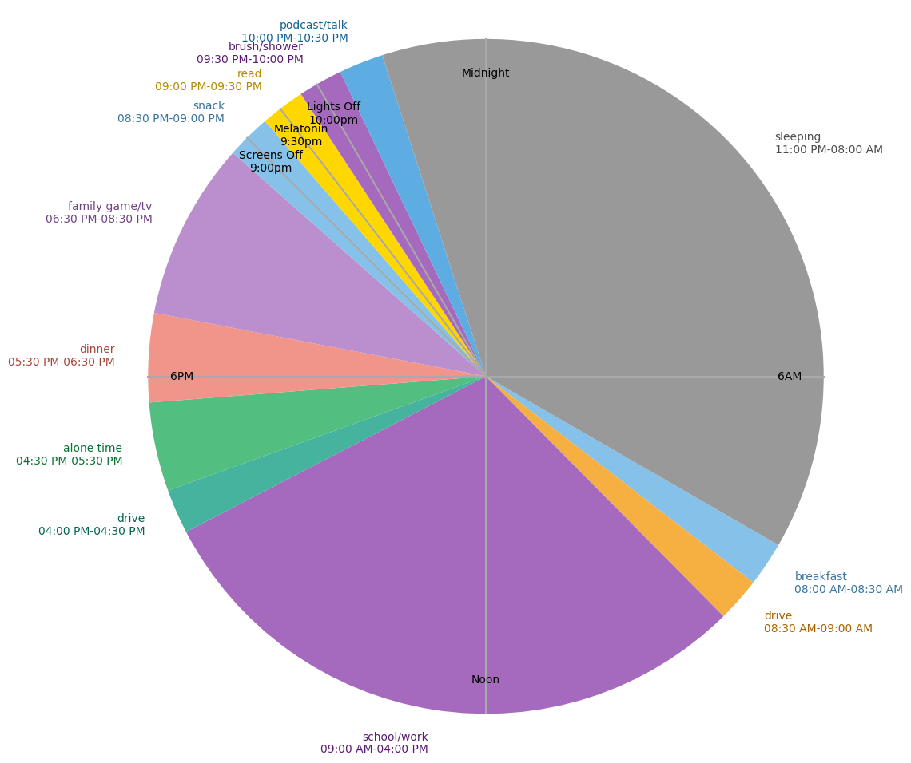

# Pie Day

This is a Python script that generates a pie chart visualizing a day's activities. The activities are read from a CSV file and displayed on the pie chart with different colors for each activity. The chart also includes lines and labels for specific times of the day.



## Requirements

- Python 3.6 or higher
- matplotlib library

## How to Run

1. Ensure that you have Python 3.6 or higher installed. You can download Python from the [official website](https://www.python.org/downloads/).

2. Install the required libraries. You can do this by running the following command in your terminal:

```bash
pip install -r requirements.txt
```
3. Run pieday.py

```bash
python pieday.py
```

4. The script will generate a pie chart and save it as "pieday.png" in the same directory.

## Input Format

The script reads activities from a CSV file named "pieday.csv". The CSV file should have the following format:

```csv
Activity Name,Start Time,Stop Time,Duration
Sleep,10:00 PM,6:00 AM,8
Work,9:00 AM,5:00 PM,8
...
```

Each row represents an activity. The columns are:

Activity Name: The name of the activity.
Start Time: The time the activity starts, in the format "HH:MM AM/PM".
Stop Time: The time the activity stops, in the same format as Start Time.
Duration: The duration of the activity, in hours.